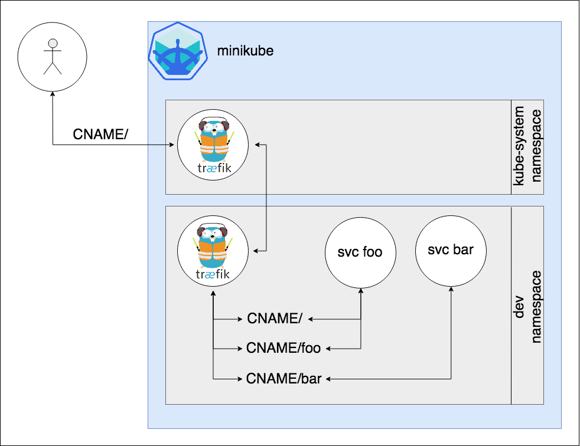
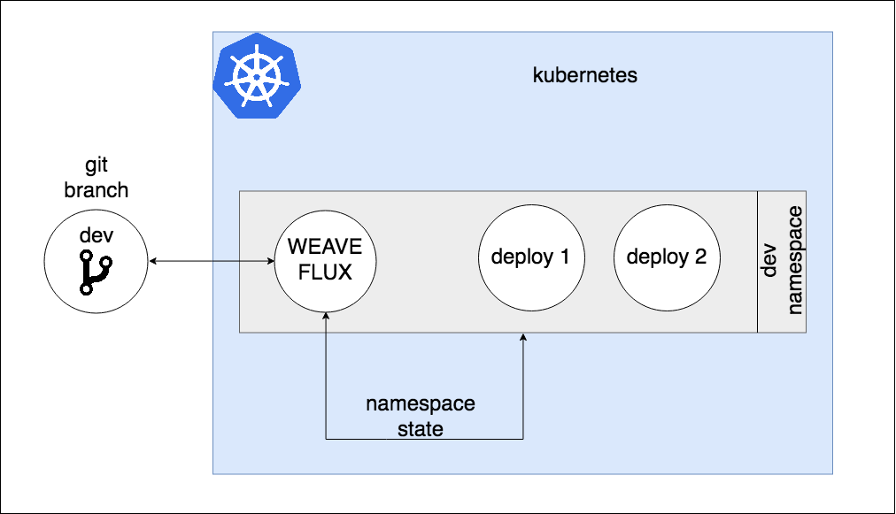

# weaveworks-flux-gitops

A boilerplate for minikube, with [weaveworks flux](https://github.com/weaveworks/flux/) and two [traefik](https://traefik.io/)'s managing both incoming ingress and internal kubernetes traffic (path redirection).

Known problems:

* it misses a way to rename kubernetes developer namespace - plan to fix later.
* images below are not aligned.

## Minikube Boilerplate Set-Up



## Flux set-up

Flux is configured to connect to this repository, on the dev branch.



## Installation guide

**Prerequisites:** have a working version of minikube on your workstation.

```sh
# deploy kubernetes ingress controller
kubectl apply -f 01-k8s-traefik-ingress
# create developer namespace
kubectl apply -f 02-k8s-namespace
# edit deploy flux deployment and add your own repo / branch
kubectl apply -f 03-k8s-flux-deploy
# optional if you do not want to use flux
# kubectl apply -f 04-k8s-proxy-traefik-ingress

# update your workstation Host Database and route
# traffic to minikube host instead of querying a DNS.

echo "$(minikube ip) traefik-ui.minikube" | sudo tee -a /etc/hosts
echo "$(minikube ip) reliability-pp.minikube" | sudo tee -a /etc/hosts
echo "$(minikube ip) reliability-pp-proxyapi.minikube" | sudo tee -a /etc/hosts
echo "$(minikube ip) reliability-pp-flux.minikube" | sudo tee -a /etc/hosts

# fluxctl has to be installed in order to work
fluxctl list-controllers --url http://reliability-pp-flux.minikube/api/flux --namespace reliability-pp
CONTROLLER                                   CONTAINER  IMAGE                          RELEASE  POLICY
reliability-pp:deployment/flux               flux       quay.io/weaveworks/flux:1.4.2  ready
reliability-pp:deployment/memcached          memcached  memcached:1.4.25               ready
reliability-pp:deployment/reliability-proxy  proxy      traefik:v1.6.5-alpine          ready
```